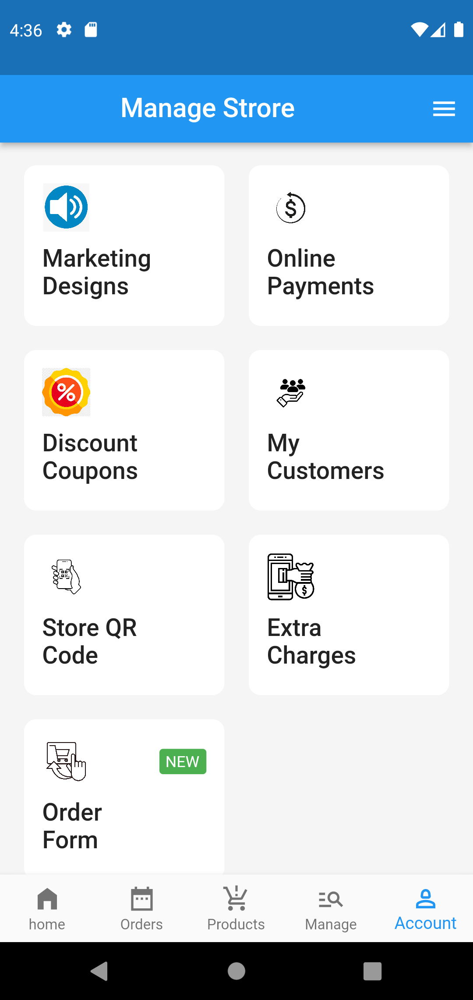
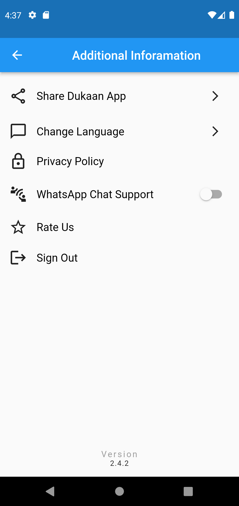
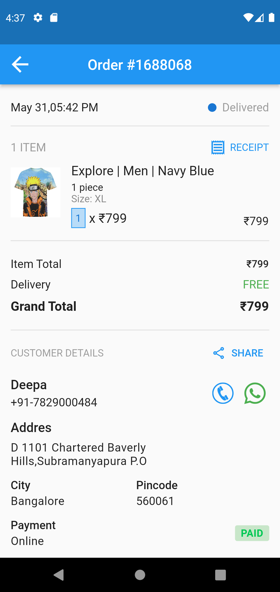
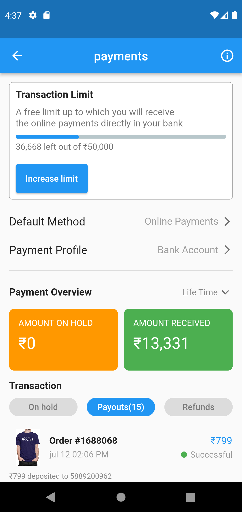

# copy_ui

I am happy to share with you my ui challege in flutter app.
i used switch,svgpicture,LinearProgressIndicator widgets etc.

## ScreenShots

<table>
    <tr>
        <td></td>
        <td></td>
        <td></td>
    </tr>
    <tr>
        <td></td>
        <td></td>
        <td></td>
    </tr>
</table>
